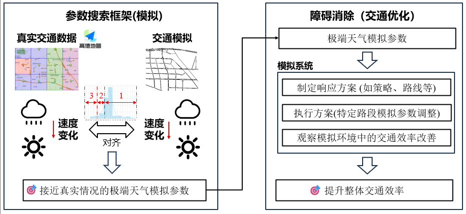

**Adverse weather traffic simulation.** We aim to align different weathers' effects in the simulation world with the actual world. 

**A parameter search framework and the snow plowing simulation.** To align with the real wolrd as much as possible, we propose a parameter search framework to adjust a set of parameters configuring the simulation, including acceleration, deceleration, maximum speed, and minimum gap between vehicles. Besides, to eliminate the adverse weather's effects, we use snow plowing as an example to explore potential solutions.

